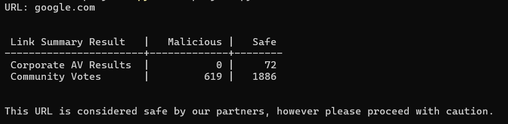
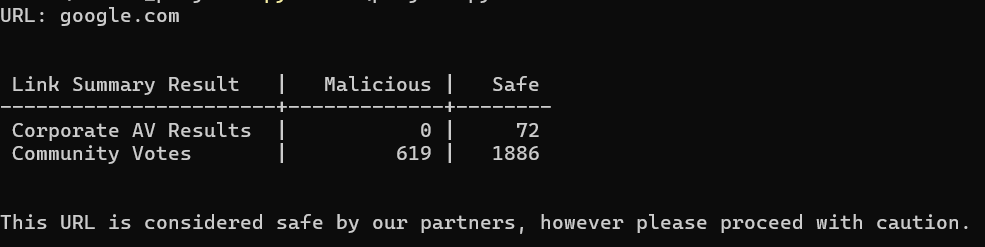

# SafeLink
SafeLink is a Python Program that helps consumers/coorporate by examine the safetyness of the link to prevent phishing with the help of VirusTotal API.

### Sneak Peek:
#### When Safe URL is provided:

#### When Malicious URL is provided:
